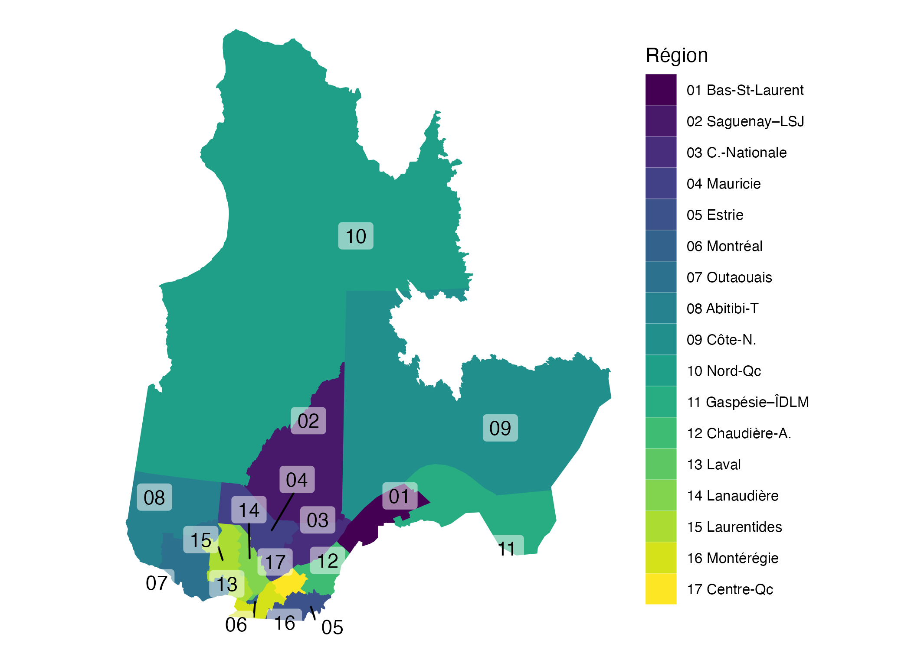

---
params:
  num_cols: 3
bibliography: ../ref/bibib.bib
title: "Guide de la Biodiversité par Région"
output: 
  html_document:
    self_contained: true
    includes:
      in_header: ../header.html
    # include-in-header: ../meta-header.html
    toc: true
    toc_float: true
    toc_extend: false
editor_options: 
  chunk_output_type: console
---

Le guide de la biodiversité du Québec utilise les données GBIF -@gbif_general et iNaturalist -@inaturalist_general (photos et liens). 

Ce projet a été créé dans le cadre d'analyse pédagogique de la biodiversité (voir article de blogue [Évologie](https://evologie.netlify.app/posts/guide_biodiv_qc/2025_05_24_guide_biodiv_qc/guide_biodiv_qc_1)).

Consultez plus d'information sur chaque espèce en cliquant sur les photos pour rejoindre un page iNaturalist. 

<!-- Retirer l'espace blanc  -->

```{=html}
<style>
.tocify-extend-page {
display: none !important;
}
</style>
```

```{r setup, echo=FALSE, message=FALSE, warning=FALSE}
library(tidyverse)
library(knitr)
library(ggplot2)
library(sf)
```

```{r data_in, echo=FALSE, message=FALSE, warning=FALSE}
# Noms combinés pour renommer ces classes
act = "Amphibiens - couleuvres - tortues"

level_path = ".."

# manual_input = FALSE 
# if (manual_input) {
#    level_path = "."
# }
# base_path =  file.path(
#   level_path, 
#   "../evologie/InCubateur/2025_05_24_Guide_biodiv_qc/output/partie_2")
  # img_csv_file = file.path(
  #   level_path,
  #   "data/path_imgs.csv")

base_path = file.path(
path.expand("~/Desktop/incubateur_blogue"), 
"2025_05_24_Guide_biodiv_qc/output/partie_2"
)
img_csv_file = file.path(
    "../data/path_imgs.csv")


# Données de noms d'espèces en français 
sp_nm_fr_mod = read.csv(
  file = file.path(base_path, 
                   "sp_nm_df_MOD.csv")) |> 
  dplyr::select(species, nom_commun_qc) |> 
  dplyr::distinct()

select_sp_tout_reg = read.csv2(file = file.path(
  base_path,
  "select_sp_tout_reg.csv"
)) 

if(file.exists(img_csv_file)) {
  dat_all = read.csv2(file = img_csv_file)
}

sp_list_fil_all <- read.csv2(
  file = file.path(base_path,
                   "sp_list_fil_all.csv")) |> 
  dplyr::select(-c(kingdom:family, nom_commun_qc)) |> 
  # Enlever duplciats 
  dplyr::distinct(species, fr_nm, .keep_all = TRUE) |> 
  # Duplicat (Océanite cul blanc)
  filter(default_photo_medium_url != "https://www.inaturalist.org/taxa/1289621") |> 
  # Ajouter les noms français 
  left_join(
    y = sp_nm_fr_mod ,
    by = join_by(species),
    relationship = "many-to-many"
  )
```

```{r diagnostic_stop, echo=FALSE, message=FALSE, warning=FALSE}
# stop("CURRENT WORKING DIRECTORY IS: ", getwd())
```

```{r prep_data, echo=FALSE, message=FALSE, warning=FALSE}
count_sp_information = select_sp_tout_reg |> 
  left_join(
    y = sp_list_fil_all,
    by = join_by(species),
    relationship ="many-to-many"
  ) |> 
  # Remplacer des noms pour l'affichage 
  mutate(
    reformat_taxo = case_when(
      class == "Amphibia" ~ act,
      class == "Squamata" ~ act,
      class == "Testudines" ~ act,
      class == "Mammalia" ~ "Mammifères",
      kingdom == "Fungi" ~ "Champignons",
      kingdom == "Plantae" ~ "Plantes",
      Type_FR == "Poissons" ~ "Poissons",
      phylum == "Arthropoda" ~ "Bobittes",
      class == "Aves" ~ "Oiseaux",
      .default = class
    ),
    # l'Orignal avait 2 noms différents, mais pas nécessaire 
    # d'être aussi précis dans le guide. Combiner les 2 photos
    # qui sont les mêmes de toute manière 
    fichier_photo = gsub(
      pattern = "Alces.americanus.jpg", 
      replacement = "Alces.alces.jpg", 
      x = fichier_photo
    )
  ) |> 
  group_by(
    species, 
    id, # ID de l'espèce iNaturalist 
    reformat_taxo, 
    fichier_photo, 
    default_photo_medium_url, 
    default_photo_attribution, #photo_att, 
    default_photo_attribution_name, # photo_att_nname, 
    MUS_NM_REG,
    nom_commun_qc) |> 
  summarise(n = sum(n)) |> 
  ungroup() |> 
  mutate(
    fichier_photo = path.expand(file.path(
      # level_path,
      "..",
          "../evologie/", 
          gsub(
            pattern = "main_page_image", replacement = "main_page_image2", x = fichier_photo)
        ))
  ) 

downscale = FALSE
if (downscale) {
# Downscale your images to thumbnails first
library(magick)
 count_sp_information = count_sp_information |> 
   mutate(img_src = sub(pattern = "\\.\\./", replacement = "", fichier_photo))

img_src = count_sp_information |> distinct(img_src) |> pull(img_src)
# Example logic to apply to your image list if they are too big:
dat_all = NULL

for (photos_i in 1:length(img_src)) {
  message(photos_i)
  # Si la photo n'existe pas, passer au prochain
  if(grepl(pattern = "evologie//NA", x = img_src[photos_i])) {next}
  if(grepl(pattern = "\\.\\./NA", x = img_src[photos_i])) {next}
  # Lire l'image
  img <- image_read( img_src[photos_i])
  # Établir l'échelle 
  img_resized <- image_scale(img, "x200") # scale to 200px height
  # Sortie
  out = file.path("../img/photos", basename(img_src[photos_i]))
  # Écriture et diminution de la qualité 
  image_write(image = img_resized, path = out, quality = 50)
  link_update = data.frame(
    link = img_src[photos_i], 
    outlink = out)
  # Combine les données 
  dat_all = bind_rows(dat_all, link_update)
}

write.csv2(
  x = dat_all,
  file = "data/path_imgs.csv", row.names = FALSE
  )
}


# Assume que la jointure se fait avec les 
count_sp_link = count_sp_information |>
  mutate(fichier_photo = basename(fichier_photo)) |> 
  left_join(
    y = dat_all |> mutate(link = basename(link)), 
    by = join_by(fichier_photo == link)
  ) |> 
    mutate(
  # ../ pour que le lien soit OK pout le .qmd
      fichier_photo = path.expand(file.path(
           level_path,
          outlink
        ))) |> 
          filter(!is.na(id))

# Lire les régions 
regqc = st_read(
  dsn = file.path(
    "../..",
    "evologie/posts/guide_biodiv_qc/2025_05_24_Guide_biodiv_qc/data/partie_1/admin_geo/admin_reg_qc",
    "mrc_s.gpkg"), 
  quiet = TRUE) |> 
  # Carte plus simple et rapide à dessiner 
  st_simplify(dTolerance = 1e3)

runion_raw = regqc |> 
  group_by(MRS_NM_REG, MRS_CO_REG) |> 
  summarise(geom = st_union(geom)) |> 
  mutate(
    # MRS_CO_REG = gsub("\\b0(\\d)", "\\1", as.numeric(MRS_CO_REG))|> as.character(), 
    code_reg  = paste(MRS_CO_REG, MRS_NM_REG, sep = " ")
  )

region_noms = tibble::tribble(
  ~MRS_CO_REG,                     ~MRS_NM_REG, ~MRS_NM_REG_short,
  "01",             "Bas-Saint-Laurent", "Bas-St-Laurent",
  "02",       "Saguenay–Lac-Saint-Jean", "Saguenay–LSJ",
  "03",            "Capitale-Nationale", "C.-Nationale",
  "04",                      "Mauricie", "Mauricie",
  "05",                        "Estrie", "Estrie",
  "06",                      "Montréal", "Montréal",
  "07",                     "Outaouais", "Outaouais",
  "08",         "Abitibi-Témiscamingue", "Abitibi-T",
  "09",                     "Côte-Nord", "Côte-N.",
  "10",                "Nord-du-Québec", "Nord-Qc",
  "11", "Gaspésie–Îles-de-la-Madeleine", "Gaspésie–ÎDLM",
  "12",          "Chaudière-Appalaches", "Chaudière-A.",
  "13",                         "Laval", "Laval",
  "14",                    "Lanaudière", "Lanaudière",
  "15",                   "Laurentides", "Laurentides",
  "16",                    "Montérégie", "Montérégie",
  "17",              "Centre-du-Québec", "Centre-Qc"
) |> mutate(
  # MRS_CO_REG = gsub("\\b0(\\d)", "\\1", as.numeric(MRS_CO_REG)) |> as.character(), 
  code_reg_small  = paste(MRS_CO_REG, MRS_NM_REG_short, sep = " ")
)


runion = runion_raw |> 
  left_join(
    y = region_noms, 
    by = join_by(MRS_CO_REG, MRS_NM_REG)
  )

sp_list_fil_all_taxo = count_sp_link |> 
  left_join(
    y = runion |> sf::st_drop_geometry(), 
    by = join_by(MUS_NM_REG == MRS_NM_REG)
  ) |> 
  # On doit retirer tous les URL == NA et donc pas de photo 
  filter(!is.na(default_photo_medium_url), 
  # Retire toutes les photos qui sont NA 
  # (À VÉRIFIER POURQUOI) -> blamer les poissons
  # (À VÉRIFIER POURQUOI)
  # (À VÉRIFIER POURQUOI)
  # (À VÉRIFIER POURQUOI)
  # (À VÉRIFIER POURQUOI)
  fichier_photo != "../NA"
  )

  # Compte nombre de manquant : à ajouter les photos...
# count_sp_link |> filter(fichier_photo == "../NA") |> group_by(species) |> count()

```

## Carte du Québec

```{r maps, echo=FALSE, warning=FALSE, message=FALSE, fig.width=7, fig.height=5, out.width="70%", fig.dpi=192}
# Faire la carte 
carte_qc = runion |> 
  ggplot() +
  geom_sf(
    linewidth = 3,
    colour = "white"
  ) +  
  geom_sf(
    # show.legend = FALSE,
    mapping = aes(
      fill = code_reg_small, 
      colour = code_reg_small
    )
  ) +  
  ggrepel::geom_label_repel(
    max.overlaps = Inf, 
    segment.square  = FALSE,
    segment.inflect = TRUE,
    min.segment.length = 0.5,
    label.size = 0,
    fill = scales::alpha("white", .5),
    aes(label = MRS_CO_REG, 
        geometry = geom), 
    stat = "sf_coordinates") +  
  coord_sf(crs = 32198)+
  scale_fill_viridis_d(name = "Région") + 
  scale_colour_viridis_d(name = "Région") + 
  # guides(fill = guide_legend(ncol = 2)) +
  theme_void()+
  theme(
    legend.text = element_text(size = 8),
    panel.background = element_blank(),
    plot.background = element_blank(),
    panel.grid.major = element_blank(),
    panel.grid.minor = element_blank(),
    legend.background = element_rect(fill = alpha("white", 0.5), color = alpha("white", 0.25), linewidth = 0.25)
    )

  # carte_qc
# ggsave(plot = carte_qc, filename = "../img/carte_qc.png", width = 7, height = 5)
# ggsave(
#   plot = carte_qc, 
#   filename = "img/carte_qc2.png", 
#   width = 7, 
#   height = 5
#   )
```

```{r Carte_qc, echo=FALSE}
knitr::raw_html('
<details class="taxa-accordion" id="map-to-move">
  <summary class="class-summary">Carte du Québec</summary>
  <div class="accordion-content" style="text-align: center;">
    
  </div>
</details>
')
```

```{r report_out, echo=FALSE}
# Définir les 'classes' taxonomiques reformattées à montrer
# target_classes <- c("Amphibia", 
                    # "Squamata", "Testudines", "Mammalia", "Aves")
target_classes <- c(
  act,
  "Mammifères", "Oiseaux", 
  "Champignons", "Plantes", "Bobittes"
  , 
  "Poissons"
  )
regions <- sort(unique(sp_list_fil_all_taxo$code_reg_small))
```


<style>
.nav > li > a {
position: relative;
display: block;
padding: 5px 5px;
font-size: 12px;
}
</style>

```{r generate_image_dictionary, results='asis', echo=FALSE}

# Espèces uniques avec images
unique_species <- sp_list_fil_all_taxo |> 
  distinct(id, fichier_photo) |> 
  filter(!is.na(fichier_photo) & fichier_photo != "" & fichier_photo != "../NA")

cat('<style>\n:root {\n')

for (i in 1:nrow(unique_species)) {
  row <- unique_species[i, ]
  
  # Fabriquer les caractères base64
  # base64_string <- base64enc::base64encode(gsub(pattern = "\\.\\./", replacement = "", row$fichier_photo))
  base64_string <- base64enc::base64encode(row$fichier_photo)


  # Mettre en variable global dans le CSS 
  cat(sprintf('  --img-sp-%s: url("data:image/jpeg;base64,%s");\n', row$id, base64_string))

}

cat('}\n</style>\n')
```


## Biodiversité


```{r run_script, results='asis', echo=FALSE}
library(htmltools)

# CSS snippet with Dark Mode Support
cat('
<style>
  /* Base Grid & Card CSS */
  .taxa-grid { display: grid; grid-template-columns: repeat(auto-fill, minmax(150px, 1fr)); gap: 10px; margin-bottom: 15px; margin-top: 15px; }
  .taxa-card { text-align: center; margin-bottom: 0px; border: 1px solid #eee; padding: 0px; border-radius: 8px; background: #fff; box-shadow: 0 2px 4px rgba(0,0,0,0.05); }
  .taxa-img { width: 100%; height: 100px; min-width: 110px; min-height: 110px; object-fit: cover; border-radius: 6px; cursor: pointer; background-size: cover; background-position: center; background-repeat: no-repeat;}
  .taxa-info { margin-top: 2px; line-height: 1.0; }
  .taxa-title { font-size: 0.8em; font-weight: bold; color: #2c3e50; }
  .taxa-obs { font-size: 0.80em; display: block; margin-top: 4px; margin-bottom: 4px; font-weight: bold; color: #2980b9; }

  /* Class Accordion Styles */
  details.taxa-accordion {
    margin-bottom: 12px;
    border: 1px solid #dcdfe6;
    border-radius: 6px;
    background-color: #ffffff;
    overflow: hidden;
  }
  details.taxa-accordion summary.class-summary {
    padding: 12px 16px;
    font-size: 1.1em;
    font-weight: bold;
    color: #2c3e50;
    background-color: #f8f9fa;
    cursor: pointer;
    user-select: none;
    border-bottom: 1px solid transparent;
    transition: background-color 0.2s ease, color 0.2s ease;
  }
  details.taxa-accordion[open] summary.class-summary {
    border-bottom-color: #dcdfe6;
    background-color: #edf2f7;
  }
  .accordion-content {
    padding: 12px;
  }

  /* ---------------------------------------------------- */
  /* Dark Mode Overrides                                  */
  /* ---------------------------------------------------- */
  body.dark-mode details.taxa-accordion {
    background-color: #1e1e1e !important;
    border-color: #333333 !important;
  }
  body.dark-mode details.taxa-accordion summary.class-summary {
    background-color: #262626 !important;
    color: #e0e0e0 !important;
  }
  body.dark-mode details.taxa-accordion summary.class-summary:hover {
    background-color: #303030 !important;
  }
  body.dark-mode details.taxa-accordion[open] summary.class-summary {
    background-color: #2d3748 !important;
    border-bottom-color: #333333 !important;
    color: #ffffff !important;
  }
  
  /* Dark Mode for inner Bootstrap Tabs */
  body.dark-mode .nav-tabs {
    border-bottom-color: #333 !important;
  }
  body.dark-mode .nav-tabs > li > a {
    color: #aaa !important;
    background-color: #1a1a1a !important;
    border-color: #333 !important;
  }
  body.dark-mode .nav-tabs > li.active > a, 
  body.dark-mode .nav-tabs > li.active > a:focus, 
  body.dark-mode .nav-tabs > li.active > a:hover {
    background-color: #2d3748 !important;
    color: #fff !important;
    border-color: #333 #333 transparent !important;
  }
</style>
')

# Outer list for class accordions
accordion_list <- list()

for (c_idx in seq_along(target_classes)) {
  current_class <- target_classes[c_idx]
  
  class_data_global <- sp_list_fil_all_taxo |> 
    filter(reformat_taxo == current_class)
  
  if (nrow(class_data_global) == 0) {
    next
  }
  
  tab_headers <- list()
  tab_contents <- list()
  is_first <- TRUE
  
  for (r_idx in seq_along(regions)) {
    current_region <- regions[r_idx]
    
    region_data <- class_data_global |> 
      filter(code_reg_small == current_region) |> 
      arrange(desc(n))
    
    if (nrow(region_data) > 0) {
      reg_title <- gsub("\\b0(\\d)", "\\1", current_region)
      
      # Unique identifiers for HTML tabs
      tab_id <- sprintf("tab-%s-%s", c_idx, r_idx)
      
      # Build Cards
      cards <- lapply(seq_len(nrow(region_data)), function(i) {
        row <- region_data[i, ]
        img_url <- if (is.na(row$default_photo_medium_url) || row$default_photo_medium_url == "") {
          "#"
        } else {
          sprintf("[https://www.inaturalist.org/taxa/%1$s](https://www.inaturalist.org/taxa/%1$s)", row$id)
        }
        
        tags$div(
          class = "taxa-card",
          tags$a(
            href = img_url, target = "_blank",
            tags$div(class = "taxa-img", style = sprintf("background-image: var(--img-sp-%s);", row$id))
          ),
          tags$div(
            class = "taxa-info",
            tags$span(class = "taxa-title", row$nom_commun_qc),
            tags$span(class = "taxa-obs", sprintf("%s Obs.", format(row$n, big.mark = " ")))
          )
        )
      })
      
      # Create Bootstrap Tab Header (LI)
      tab_headers[[length(tab_headers) + 1]] <- tags$li(
        class = if (is_first) "active" else NULL,
        tags$a(
          `data-toggle` = "tab",
          href = paste0("#", tab_id),
          reg_title
        )
      )
      
      # Create Bootstrap Tab Content Pane
      tab_contents[[length(tab_contents) + 1]] <- tags$div(
        id = tab_id,
        class = sprintf("tab-pane fade %s", if (is_first) "in active" else ""),
        tags$div(class = "taxa-grid", cards)
      )
      
      is_first <- FALSE
    }
  }
  
  # Group tabs together inside the class section
  if (length(tab_headers) > 0) {
    tabs_container <- tags$div(
      class = "tabbable",
      tags$ul(class = "nav nav-tabs", tab_headers),
      tags$div(class = "tab-content", tab_contents)
    )
    
    accordion_list[[length(accordion_list) + 1]] <- tags$details(
      class = "taxa-accordion",
      tags$summary(class = "class-summary", current_class),
      tags$div(class = "accordion-content", tabs_container)
    )
  }
}

# Safely print HTML without Pandoc errors
knitr::raw_html(as.character(tagList(accordion_list)))
```


## Références

::: {#refs}
:::


### Photo attributions


<details class="taxa-accordion">
  <summary class="class-summary">Crédits photographiques</summary>
  <div class="accordion-content" style="font-size: 0.6em; line-height: 1.5; padding-top: 10px;">

<!-- ::: {style="font-size: 0.6em;"} -->

```{r photolic, echo=FALSE, results='asis'}
sp_list_fil_all_taxo |> 
  distinct(default_photo_attribution_name) |> 
  na.omit() |> 
  pull() |> 
  gsub(pattern = ", some rights reserved|, uploaded by.*$|, all rights reserved|no rights reserved|CC |\n|\\*\\*", 
       replacement = "") |> 
  # gsub(pattern = "\\(c\\)", replacement = "\u00A9") |> 
  gsub(pattern = "\\(c\\) ", replacement = "") |> 
  gsub(pattern = "@", replacement = "_at_") |> 
  sort() |> 
  cat(sep = "; ")
```

  </div>
</details>

<!-- ::: -->